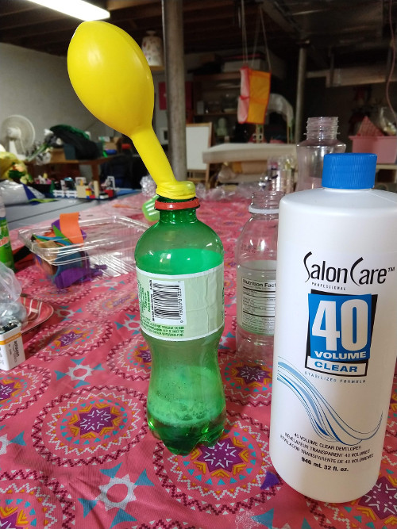

# Soap Foam AKA Elephant Soap

Hydrogen Peroxide (H2O2) with mixed with a yeast (a catalyst) with produce Water (H2O), Oxygen (O) and HEAT.

## Goal
Science is FUN and you can do it at home!

Also, to show that hydrogen peroxide is much much different than water.
In the [Water Electrolysis](WaterElectrolysis.md) experiment, we saw that water is made up of 2 hydrogen atoms and one oxygen atom.  Both hydrogen and oxygen are gasses but combined they form a liquid!  

If ONE more oxygen atom is added; we get Hydrogen peroxide!  Hydrogen Peroxide is a liquid that looks like water. And, it really really wants to be water.  When it gives up an oxygen atom, an exothermic (e.g. produces HEAT) reaction occurs.

Soap is one way we  can capture the oxygen gas!  

## Materials

* Empty soda bottle
* Measuring cup and measuring spoons
* Salon-grade hydrogen peroxide (6-8 percent by volume; 20, 30 or 40 clear developer)
* Concentrated dish soap
* Liquid food coloring four-pack (green, red, yellow, and blue)
* Large tray or newspaper to protect surface from mess
* Funnel
* Small container
* Active dry yeast
* Long Stem matches (Optional)
* Balloon (Optional)

## Steps
In large flask or soda bottle mix:
 * 2 cups salon-grade hydrogen peroxide,
 * 1 teaspoon dish soap, 20 drops each green and red liquid food coloring, and 10 drops each yellow and blue food coloring. (Tip: Standard 3 percent by volume peroxide from the drug/grocery store will work too, but with less effect.)

Place flask or soda bottle in large tray or on protected surface and place funnel in opening of flask or soda bottle.

In a small container, thoroughly mix
* 2 tablespoons yeast and
* 6 tablespoons warm water. Let sit for 2 minutes.

Pour yeast mixture into funnel, quickly remove funnel from flask or bottle, and step back!

### Smaller bottles
If you are using small 16oz water bottles use about 1/2 cup of H2O2.

## Time
30 min
## Lesson
* H2O2 is Hydrogen peroxide
& H2O is Water
** What a difference One little Oxygen makes.

Water => Safe, stable
H2O2 => Can be harmful, can cause burns, not stable.

## Level of effort
Easy

## Clean up: Level of effort
* Mess factor HIGH.  Do outside.

* Pretty Safe: However, Wear safety glasses and gloves.
High strength Hydrogen Peroxide can cause burns.

## Pointers
Show that it is Oxygen that is being produced

(WARNING: ADULTS ONLY)
Do the same experiment with 3% Hydrogen Peroxide and some yeast (NO SOAP).  Then take a match with a very LONG stem and place it in the container.  It will RAPIDLY light up!

## Extra
Soap is not the only way to capture the Oxygen.  You can use a balloon.
Steps:
* Place some dry yeast in a balloon.
* Place 1/2 cup of hydrogen peroxide in a soda bottles
* Place the balloon on the soda bottle
    * Take care not to get the yeast into the bottle
* Tip the yeast into to bottle.

## References
* [Martha Steward Recipe](https://www.marthastewart.com/863046/elephant-toothpaste)
* [Endo ad Exo thermic eperiments](https://www.acs.org/content/dam/acsorg/education/resources/k-8/science-activities/chemicalphysicalchange/chemicalreactions/heat-up-to-some-cool-reactions.pdf)
