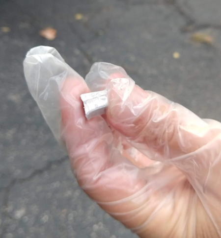

# Sodium

## Objective
Give kids first hand experience with chemical properties.

Let them see how those properties change significantly when a molecule is formed.  

## Talking Points
Salt is made up of two elements: Sodium and Chlorine.
* Our body needs salt to live.
* Our body is also made up of mostly water
* Sodium gets really really hot in water!

### Physical properties:
Salt:
* Clear crystal.
* Hard
* Dissolves in water, no heat

Sodium:
* Shinny medal
* Bendable: show how easy it is to cut
* Reacts in water
* Gets really, really hot in water
   * try to catch a stick on fire when you put a little bit of sodium in water

## Materials
- Salt: NaCl
- Sodium: Na
- Water
- Large bucket
- Gloves
- Safety glasses
- Sticks.  like what you use to make vegetable kabobs

## Difficulty
Surprisingly easy to get sodium.

***Danger level: High***

READ Sodium's [msds sheet](./doc/msds_sodium.pdf)

## Pointers
Use ONLY a little bit of sodium at a time.  Dime size.
***Danger level: High***
Make sure everyone is wearing safety glasses

DO NOT TOUCH the sodium when it is in the water.  Did I mention it gets really really hot.  You will burn yourself.
