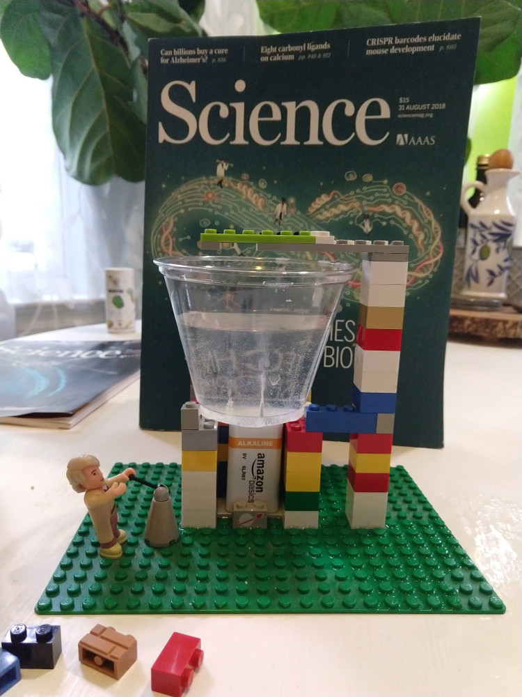

# Water Electrolysis: H2O to 2H and O
 

Electrolysis of water is the decomposition of water into oxygen and hydrogen gas due to the passage of an electric current. The reaction has a standard potential of −1.23 V.

 That means if you supply a potential difference greater than 1.23 volts you can split water!  Say with a 9V battery, you can make some gas!!!

 **NOTE:**  The Hydrogen side makes twice as much gas as the oxygen side because it is H2  O.  

## Goal
Use simple office supplies and Legos (optional) to separate the hydrogen from the oxygen in water.

## Materials
- [ ] 1 Plastic Cup
- [ ] 2 Thumb tacks
- [ ] 1 Nine Volt Battery
- [ ] pinch of Baking Soda
- [ ] Water: H2O
- [ ] 2 Plastic Pipettes or empty water bottles (optional if collecting the gas)

### Optional Materials
- [ ] Legos

## Time
30 minutes with Legos
## Lesson
It is just fun just make Hydrogen.
- [ ] Go over what a molecule is
- [ ] Point out that the pin making the H2 has twice as much bubbles
- [ ] Connect bonds potential to electrical potential.  

## Level of effort
Easy

## Clean up: Level of effort
- [ ] Easy

## Pointers

* ***DO NOT USE*** SALT.

Using NaCl (table salt) in an electrolyte solution results in chlorine gas rather than oxygen due to a competing half-reaction ([Wikipedia: Water Electrolysis](https://en.wikipedia.org/wiki/Electrolysis_of_water)).

## References
* [Excellent Video](https://www.youtube.com/watch?v=HQ9Fhd7P_HA)

* [Wikipedia: Water Electrolysis](https://en.wikipedia.org/wiki/Electrolysis_of_water)

